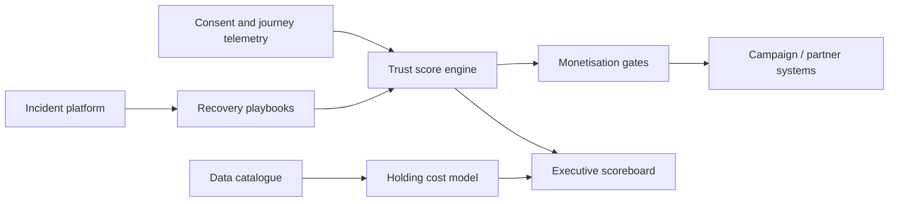

# Trustkeep

**Source:** `ai-in-decentralized+ai/Accenture-Strategy-DD-GDPR-POV/`
**Domain:** `ai-decentralized`
**One-liner:** An enterprise digital-trust scoreboard that ties customer-journey consent hygiene, breach-response recovery, and stale-PII cost burn-down to whether the brand keeps lawful access to personal data.
**Wedge:** Consumer brands and telcos with EU exposure whose CMO/CDO pair owns “vote with data” risk — starting with three journeys (acquire, service, win-back) and a monthly trust operating review.
**Positioning:** Digital trust as a commercial operating system. Accenture Strategy’s POV argues PII alone is not enough: data is currency, GDPR can shut off processing after poor breach handling, 45% of consumers switched for lost trust, yet 4 in 10 increase trust when breaches are handled well — and cleansing inactive records saves ~$1.50/record/year.

## Market research synthesis

### Thesis from source

Nick Taylor and Ulf Grosskopf position personal data as the bedrock currency of digital society. By 2020 each consumer’s digital shadow is estimated at about 2.5GB, expanding into biometric, visual, genomic, and device data. GDPR (25 May 2018) puts individuals in the driver’s seat: they choose which organisations access which pieces of data for which purposes. Failure to report breach scale and impact within 72 hours can bar processing; fines reach 4% of group global revenue or EUR20m.

The World Economic Forum projection cited exceeds half a trillion dollars for the global data market by 2024, while Accenture research finds roughly one in three targeted cyberattacks results in a breach. The POV’s burden-to-opportunity table is the commercial brief: stricter consent raises opt-in quality; processing records improve efficiency; privacy-by-default and minimisation cut cost and noise; governance sharpens investment; third-party accountability unlocks safer sharing value. Concrete benefits already observed include storage-cost reduction by cleansing inactive customers (~$1.50 per record per year), better experience when customers volunteer data (Pandora), and monetisation only after trust is established — given 90% of consumers would limit certain PII and stop retailers selling to third parties.

The “circle of trust” quantifies stakes: 82% of companies say weak security/ethical controls could exclude them from essential digital platforms; eight in ten consumers say trust drives loyalty; 45% switched providers after lost trust; handled-well breaches restore trust in four of ten cases. Consumers also vote with data: two-thirds share for perceived value; three-quarters would give a birthday for a deal; one in four share for better service or choosable third-party sharing. Program advice rejects tech-only GDPR: prioritise customer journeys, empower cross-functional teams, keep program structure simple (avoid 100+ nodes), and treat tools as non-silver-bullets.

### Buyer & economic model

- **Primary buyer:** CDO paired with CMO / Chief Customer Officer; economic co-sponsor is often the Chief Risk Officer for breach posture.
- **Users:** journey owners, privacy program leads, breach incident commanders, data stewardship analysts, finance partners tracking data holding cost.
- **Budget owner / value metric:** growth and risk budgets; value metric is retained opt-in rate and avoided processing bans, plus $ saved from stale-PII burn-down.
- **Competing status quo:** compliance checklists disconnected from journey KPIs; breach IR runbooks without trust recovery metrics; data lakes that never delete inactive profiles.

### Domain constraints

- **Regulatory / trust / safety:** GDPR consent specificity, 72-hour breach regime, purpose limitation; platform-exclusion risk from weak ethics controls.
- **Data sensitivity:** trust scores and breach playbooks are confidential; subject-level data minimised in the scoreboard.
- **Change-management realities:** avoid 100-node program sprawl; product must map to a handful of journeys and a standing cross-functional forum.

## Business requirements

- BR-1: Trust KPIs must be computed per prioritised customer journey, not only as an enterprise average.
- BR-2: Breach playbooks must include timed trust-recovery actions and measure post-incident trust delta where survey or behavioural proxies exist.
- BR-3: Stale or inactive PII holding cost must be estimable (defaulting to a configurable per-record annual cost such as $1.50) with burn-down targets.
- BR-4: Monetisation or third-party sharing initiatives must pass a trust-and-permission gate before launch.
- BR-5: Opt-in and revoke rates must be reportable as leading commercial indicators alongside revenue.
- BR-6: Program structure in the tool must stay simple — journey-based workstreams, not 100+ regulation category nodes per division.
- BR-7: Cross-functional decision logs (compliance, business, technology) must be attachable to trust actions.
- BR-8: Exclusion risk from digital platforms due to weak ethical/security controls must be trackable as an executive risk item.
- BR-9: Consumer value propositions for data sharing must be catalogued so “vote with data” outcomes can be attributed.
- BR-10: Erasure execution mechanics are out of scope beyond signalling open forget volumes to Trustkeep dashboards.
- BR-11: Exports must support board and regulator narrative without dumping raw PII.
- BR-12: When trust falls below a configured threshold on a journey, monetisation gates must auto-block until remediated.

## User stories

Canonical user stories live in sibling [USER_STORIES.md](USER_STORIES.md).

## System design

### Overview

Trustkeep aggregates journey telemetry (consent events, revokes, complaints), incident timelines, inventory cost estimates, and monetisation proposals into a scoreboard with gates. It does not delete data or run DSAR workflows; it decides when the business is allowed to use and monetise data under a trust doctrine.

### Actors & boundaries

- **Actors:** CDO, CMO delegates, privacy, IR, finance, auditors.
- **Trust boundary:** scoreboard stores aggregates and ticket references; subject-level payloads stay in source systems.
- **Human-in-the-loop points:** threshold overrides, playbook activation, monetisation approvals.

### Core capabilities

1. **Journey trust scoring**
2. **Breach trust-recovery playbooks**
3. **Stale-PII cost inventory**
4. **Monetisation permission gates**
5. **Cross-functional decision log**
6. **Executive / board export**

### Conceptual data

- **Primary entities:** Journey, TrustScore, ConsentMetric, BreachIncident, PlaybookRun, DataHoldingCost, MonetizationProposal, DecisionLog, GateState.
- **Critical events:** score computed, threshold breached, playbook started, cost burn-down recorded, gate blocked/released.
- **Retention / audit needs:** scores and decisions retained for board and supervisory narrative windows.

### Integrations (conceptual)

- **Systems of record:** CDP/CRM consent stores, incident management, data catalogue, marketing offer systems.
- **Upstream signals:** revoke events, NPS/trust surveys, breach detections.
- **Downstream actions:** campaign suppressions, monetisation blocks, cleansing work orders.

### High-level architecture

### Success metrics

- **Leading:** journey opt-in rate; revoke rate; time-to-customer-notice in breaches; % inactive records queued for cleanse.
- **Lagging:** provider switches attributed to trust loss; post-breach trust recovery rate; storage $ saved; monetisation incidents avoided by gates.

## OpenAPI skeleton

Canonical HTTP surface lives in sibling [openapi.yaml](openapi.yaml). Summary:

- **Base path:** `/v1/...`
- **Auth:** API key and Bearer JWT.
- **Resource groups:** Journeys, TrustScores, BreachPlaybooks, DataHoldingCosts, MonetizationGates.
