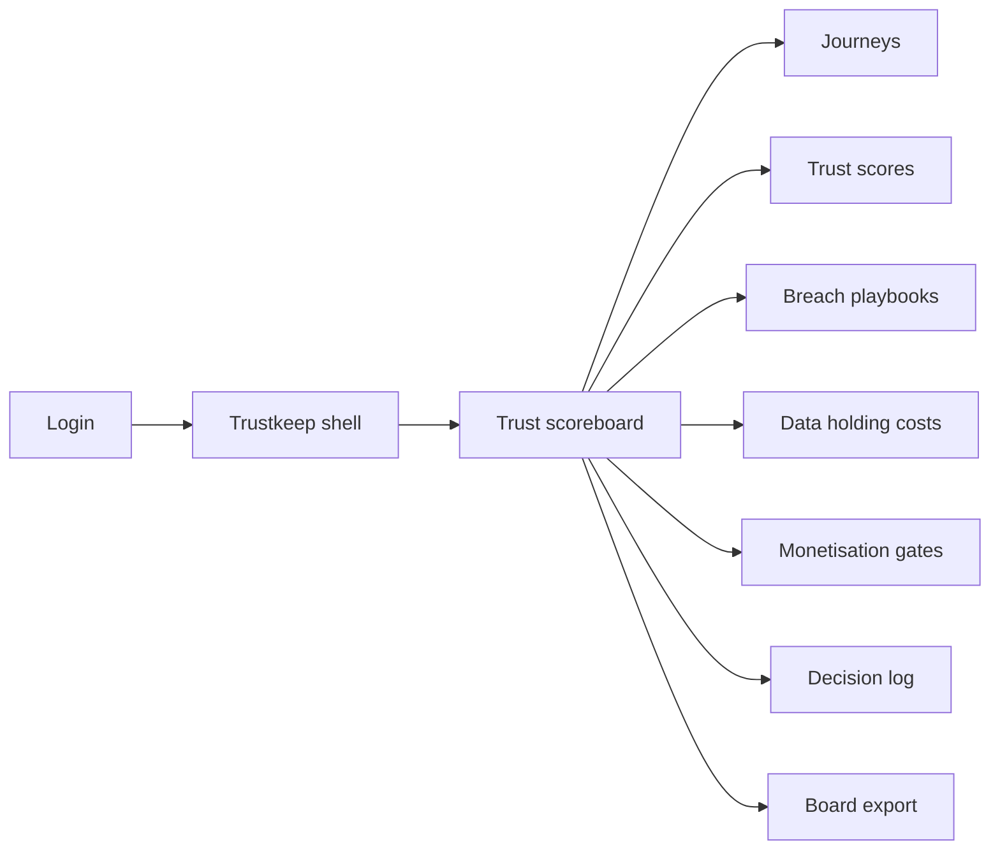
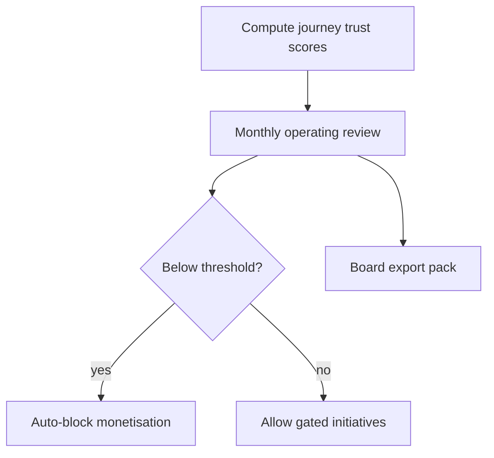

# Trustkeep — Web app

**Product:** [PRODUCT.md](./PRODUCT.md)
**Primary surface:** Executive digital-trust scoreboard (journey operating review)
**Secondary surfaces:** Breach trust-recovery playbook runner; board export pack (read-only)
**Design thesis:** Trustkeep is a commercial trust operating system — the UI metaphor is a monthly journey scoreboard with monetisation gates, not a DSAR desk or offer studio. Visual language is deep ink blue with signal-gold for healthy trust bands and rust-red for gated journeys; stale-PII burn-down reads like a CFO cost curve beside consent hygiene. The brand wordmark sits as a quiet mint-mark on every gate and board pack so executives know whose “vote with data” doctrine they are running.

## UX research synthesis

### Category peers (best-in-class)

- **Diligent / Board intelligence portals:** Executive-ready risk scoreboards with exportable narratives. Steal: journey-level KPIs for monthly operating review (BR-1, BR-6); reject 100-node compliance taxonomies.
- **ServiceNow Security Incident Response:** Timed playbooks with communication tracks. Steal: 72-hour regulatory + customer tracks with post-incident trust delta (BR-2); reject IR tooling that never feeds commercial gates.
- **Collibra / Alation cost & stewardship views:** Inventory holding cost and cleanse work orders. Steal: per-record annual cost model (~$1.50 default) with burn-down targets (BR-3); reject data-catalog sprawl as the home.
- **Amplitude / Mixpanel journey analytics:** Opt-in and revoke as product metrics. Steal: leading commercial indicators beside revenue (BR-5); reject vanity engagement without permission quality.

### Patterns to adopt / reject

- **Adopt:** Per-journey trust scores; auto-block monetisation below threshold (BR-12); breach recovery with trust proxies; stale-PII $ burn-down; cross-functional decision log; platform-exclusion risk item (BR-8); value-proposition catalogue attribution (BR-9).
- **Reject:** Erasure execution as core UX (BR-10); Offertrail offer-editor as home; purple AI trust chat; enterprise-only averages that hide journey failure; cream-terracotta legal brochure look.

### Trust, density, and workflow constraints from PRODUCT.md

KPIs per journey not only enterprise average (BR-1). Breach playbooks measure recovery (BR-2). Holding cost estimable (BR-3). Monetisation gated (BR-4, BR-12). Opt-in/revoke as commercial indicators (BR-5). Simple journey workstreams (BR-6). Decision logs attach to actions (BR-7). Platform exclusion risk trackable (BR-8). Catalogue value props (BR-9). Signal forget volumes only — no erase mesh (BR-10). Board exports without raw PII (BR-11).

## Information architecture

### Nav model

### Roles → default home

| Role | Default home | Why |
|------|--------------|-----|
| CDO | Trust scoreboard | Monthly operating review (BR-1) |
| Journey owner / CMO delegate | Journey trust detail | Opt-in/revoke for their path (BR-5) |
| Breach incident commander | Breach playbooks | 72-hour + recovery tracks (BR-2) |
| Privacy program lead | Decision log / gates | Simple structure + third-party gate (BR-6, BR-4) |
| Finance partner | Data holding costs | Stale-PII $ burn-down (BR-3) |
| Board / auditor | Board export | Narrative without PII (BR-11) |

### Cross-links to OpenAPI resources

| Nav area | OpenAPI tags / resources |
|----------|---------------------------|
| Journeys | Journeys |
| Trust scores | TrustScores |
| Breach playbooks | BreachPlaybooks |
| Data holding costs | DataHoldingCosts |
| Monetisation gates | MonetizationGates |

## Screen inventory

### Trust scoreboard (home)

- **Purpose:** Answer “which journeys still earn lawful access — and where is monetisation blocked?” in one composition.
- **Entry:** Post-login for CDO/CMO.
- **Layout regions:** Brand + period selector; journey score bands; gate status strip; stale-PII $ sparkline; open forget-volume signal (read-only); platform-exclusion risk chip.
- **Primary actions:** Open journey; review blocked gates; start monthly review pack.
- **Empty / loading / error:** Empty = define three starter journeys (acquire, service, win-back); error = retry with request id.
- **BR / story ties:** BR-1, BR-5, BR-8, BR-12; CDO stories.

### Journey trust detail

- **Purpose:** Drill consent hygiene and trust trend for one prioritised journey.
- **Entry:** Scoreboard tile; nav → Journeys.
- **Layout regions:** Opt-in/revoke charts; complaint proxies; linked value propositions; decision log snippets; monetisation gate state.
- **Primary actions:** Propose remediation; request gate override (logged); open related offers system deep link (read-only).
- **Empty / loading / error:** Missing telemetry = amber instrumentation checklist.
- **BR / story ties:** BR-1, BR-5, BR-9.

### Breach trust-recovery playbooks

- **Purpose:** Run timed recovery so handled-well breaches can rebuild loyalty.
- **Entry:** IR alert; nav → Breach.
- **Layout regions:** Incident list; 72-hour regulatory track; customer-communication track; trust proxy capture; playbook run timeline.
- **Primary actions:** Activate playbook; log notices; record post-incident trust delta; feed score engine.
- **Empty / loading / error:** Empty = healthy; missed 72-hour milestone = rust blocking cue.
- **BR / story ties:** BR-2; incident commander stories.

### Data holding cost inventory

- **Purpose:** Estimate inactive PII holding cost and track burn-down for CFO-readable ROI.
- **Entry:** Finance default; scoreboard sparkline.
- **Layout regions:** Inventory cohorts; configurable $/record/year (default $1.50); burn-down target vs actual; cleanse work-order links.
- **Primary actions:** Adjust cost model; queue cleanse; export savings narrative.
- **Empty / loading / error:** Model exception path when estimates wrong (finance story).
- **BR / story ties:** BR-3; finance partner stories.

### Monetisation permission gates

- **Purpose:** Block third-party sharing / monetisation when trust below threshold.
- **Entry:** Score breach; nav → Gates; privacy lead.
- **Layout regions:** Proposal queue; trust-and-permission checklist; auto-block banner; release criteria.
- **Primary actions:** Submit proposal; approve/deny; release after remediation.
- **Empty / loading / error:** Auto-block cannot be silently cleared (BR-12).
- **BR / story ties:** BR-4, BR-12; privacy lead stories.

### Cross-functional decision log

- **Purpose:** Attach compliance/business/technology decisions to trust actions without 100-node maze.
- **Entry:** From any gated action; privacy nav.
- **Layout regions:** Chronological decisions; journey tags; attendees; outcome.
- **Primary actions:** Add decision; link to gate or playbook; export for audit.
- **Empty / loading / error:** Empty = prompt to log monthly review.
- **BR / story ties:** BR-6, BR-7.

### Board / regulator export

- **Purpose:** Narrative pack of scores, gates, recovery, and cost burn-down without raw PII.
- **Entry:** Auditor/CDO export.
- **Layout regions:** Pack builder; preview; download.
- **Primary actions:** Generate monthly OR pack; share time-boxed link.
- **Empty / loading / error:** Incomplete journeys listed as gaps.
- **BR / story ties:** BR-11.

### Platform exclusion risk register

- **Purpose:** Track risk of exclusion from digital platforms due to weak ethical/security controls.
- **Entry:** Scoreboard chip; risk nav.
- **Layout regions:** Risk items; owners; mitigation status; link to gates.
- **Primary actions:** Update status; escalate to board pack.
- **Empty / loading / error:** Empty = monitored-clear state.
- **BR / story ties:** BR-8.

## Key flows

1. **Monthly trust OR** — compute journey scores → review opt-in/revoke → check gates → attach decisions → export board pack (BR-1, BR-5, BR-7, BR-11).

2. **Breach recovery** — detect → activate playbook → 72-hour tracks → record trust delta → update scores (BR-2).

3. **Stale-PII burn-down** — inventory inactive → apply $/record → queue cleanse → show $ saved on scoreboard (BR-3).

4. **Monetisation attempt under low trust** — proposal → gate check → auto-block until remediated (BR-4, BR-12).

5. **Signal forget volumes** — ingest open erasure counts as dashboard signal only — no execution (BR-10).

## Design system

### Tokens (CSS variables)

- `--color-ink: #E7ECF4` — primary text on dark
- `--color-ink-950: #070B12` — app ground
- `--color-ink-900: #101826` — panels
- `--color-ink-700: #2A3648` — rules
- `--color-gold: #D4A84B` — healthy trust band
- `--color-gold-dim: #7A5C24` — gold on dark
- `--color-rust: #C44B3C` — gated / threshold breach
- `--color-teal: #3AA6A0` — burn-down progress / recovery win
- `--color-steel: #8494A8` — secondary labels
- `--color-brand: #B8C7DC` — Trustkeep wordmark (cool steel)
- `--font-display: "Libre Franklin", sans-serif`
- `--font-mono: "IBM Plex Mono", monospace` — score values, incident ids
- `--space-1`…`--space-8`: 4px scale
- `--radius-sm: 4px`; `--radius-md: 8px`
- `--motion-score: 220ms ease-out` — band change
- `--motion-gate: 200ms ease-in-out` — block veil
- `--motion-recover: 260ms ease-out` — playbook step complete
- Atmosphere: subtle horizontal scoreboard rules on ink-900; executive briefing density — no stock handshake photos.

### Typography & brand

- Libre Franklin for titles and KPI numerals; mono for scores and incident ids.
- Brand on scoreboard and every gate screen.
- Login: brand hero; headline (“Keep the right to process”); one CTA — no fine-amount wallpaper.

### Do / don’t

- **Do:** Per-journey scores; auto-block monetisation; show $ burn-down; keep IA to a handful of journeys.
- **Don’t:** Build erasure workspace here; purple trust chatbot; 100-node legal tree; Offertrail editor chrome.

### Accessibility & domain trust cues

- AA+ contrast; gate blocks announced via live regions and text.
- Focus order: scoreboard → journey → gates → playbooks → costs → export.

## Component patterns

- **JourneyTrustBand** — score band with opt-in/revoke sparklines.
- **MonetizationGateBanner** — auto-block when below threshold.
- **BreachRecoveryTimeline** — 72-hour dual track.
- **HoldingCostCurve** — $/record burn-down.
- **DecisionLogEntry** — cross-functional attachment.
- **PlatformExclusionChip** — executive risk cue.
- **ForgetVolumeSignal** — read-only open-erasure count.
- **BoardPackExport** — narrative without PII.

## Out of scope for v1 web

- Erasure fan-out execution (Erasuremesh); offer composition studio (Offertrail); full CMP/CDP replacement; native mobile executive apps; multi-tenant agency white-label.
